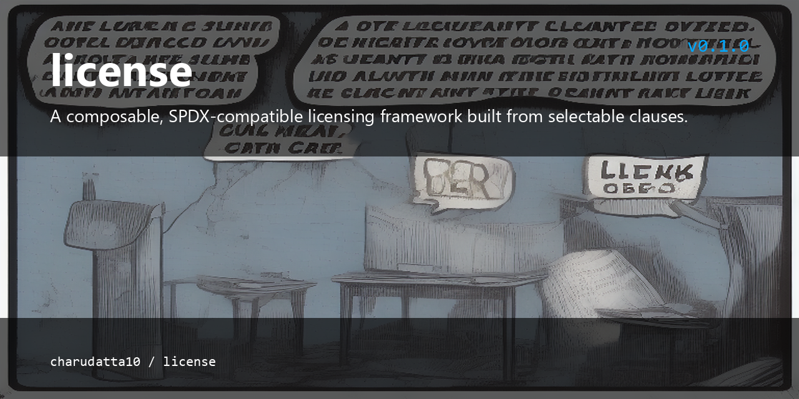

# GLG - Granular License Generator

<p align="center">
  
</p>


 

A modern, Rust-based license compiler that generates deterministic, granular software licenses from a comprehensive questionnaire. GLG compiles licenses from predefined clause templates, supports 30+ standard license types, and produces multiple output formats -- all from a single, offline-first binary.

## What is this?

GLG (Granular License Generator) is a deterministic, offline-first license compiler written in Rust. It turns a 300+ question questionnaire and 30+ SPDX license types into granular, auditable licenses, using a clause-template compiler with dependency resolution and conflict detection. It exports to 9 formats (including SPDX JSON and CycloneDX SBOM), supports Ed25519 signing and QR verification codes, and can optionally explain or suggest licenses through an AI provider — all from a single binary with no cloud dependency.

## Features

- **300+ granular questions** covering ownership, copyright, commercial use, patent, trademark, AI/ML, compliance, privacy, and more
- **Clause template compiler** with dependency resolution, conflict detection, and variable substitution
- **30+ SPDX license types**: MIT, Apache-2.0, GPL-2.0/3.0, AGPL-3.0, BSD-2/3/4-Clause, ISC, MPL-2.0, LGPL, Unlicense, CC0, and many more
- **SPDX expression parser** supporting AND, OR, WITH operators and LicenseRef custom identifiers
- **9 export formats**: Plain Text, Markdown, HTML, JSON, YAML, TOML, XML, SPDX (JSON), CycloneDX SBOM
- **Digital signatures** with Ed25519 (and ECDSA/RSA simulation), key generation, and verification
- **QR code generation** as SVG for license verification links
- **License compatibility engine** with pairwise analysis, upgrade path detection, and batch checking
- **Validation engine** with structural checks, SPDX validation, clause conflict detection, completeness scoring, and template variable verification
- **AI integration** via optional LLM providers (Ollama, OpenAI-compatible, Claude, Gemini, DeepSeek, OpenRouter, llama.cpp)
- **Interactive web UI** served via axum with dark/light themes, step wizard, live preview, search, and export
- **Static PWA build** — single-file `index.html` that works fully offline with no server
- **Deterministic output**: identical inputs always produce identical license text and hashes
- **Offline-first**: no cloud dependency, all databases embedded in the binary
- **Dual license**: MIT OR Apache-2.0

## Installation

### Scoop (Windows)

```sh
scoop bucket add chaito10 https://github.com/chaito10/scoop-bucket
scoop install licra
```

### From crates.io (when published)

```sh
cargo install glg
```

### Build from source

Requires Rust 1.75 or later.

```sh
git clone https://github.com/glg-project/glg.git
cd glg
cargo build --release
```

The binary will be at `target/release/glg`.

### Verify installation

```sh
glg --version
glg doctor
```

## Quick Start

Generate a license interactively using the web UI:

```sh
glg web
# Open http://127.0.0.1:8080 in your browser
```

Or generate from the command line:

```sh
glg new --name "My Project" --license-type mit --output .
```

This creates `LICENSE`, `LICENSE.md`, and `LICENSE.json` in the current directory.

## CLI Usage

### glg web

Start the interactive web UI.

```sh
glg web
glg web --address 0.0.0.0:3000
```

### glg new

Create a new license interactively or with flags.

```sh
glg new --name "My Project" --license-type mit
glg new --name "Backend" --license-type apache2 --output ./licenses
glg new --name "Library" --license-type gpl3
glg new --name "Internal Tool" --license-type proprietary
```

### glg open

Display an existing license file.

```sh
glg open LICENSE
glg open LICENSE.json
```

### glg generate

Generate license files from a JSON configuration.

```sh
glg generate --config license-request.json --output ./out
glg generate --config request.json --formats text,md,html,json --output .
```

### glg export

Export a license to a specific format.

```sh
glg export --input LICENSE.json --format md
glg export --input LICENSE.json --format html --output LICENSE.html
glg export --input LICENSE.json --format spdx
glg export --input LICENSE.json --format cyclonedx
glg export --input LICENSE.json --format yaml
```

### glg import

Import a license from SPDX, JSON, or YAML.

```sh
glg import LICENSE.spdx.json
glg import existing-license.json --output imported.json
```

### glg validate

Validate a license for completeness and correctness.

```sh
glg validate LICENSE
glg validate LICENSE.json
```

### glg compare

Compare compatibility between two or more licenses.

```sh
glg compare MIT Apache-2.0
glg compare MIT GPL-3.0-only --verbose
glg compare MIT BSD-2-Clause ISC
```

### glg explain

Explain a license in plain language.

```sh
glg explain LICENSE
glg explain LICENSE --ai
glg explain MIT
```

### glg sign

Digitally sign a license file.

```sh
glg sign LICENSE
glg sign LICENSE --algorithm ed25519 --key my-key.json
```

### glg verify

Verify a digital signature on a license.

```sh
glg verify LICENSE
glg verify LICENSE --key public-key.json
```

### glg hash

Compute cryptographic hashes for files or directories.

```sh
glg hash LICENSE
glg hash ./src --algorithm blake3
glg hash LICENSE --algorithm all
```

### glg ai

Query the AI assistant for license guidance.

```sh
glg ai LICENSE --task explain
glg ai "MIT, Apache-2.0" --task conflicts
glg ai LICENSE --task summarize
glg ai LICENSE --task recommend
glg ai "permissive with patent grant" --task suggest
```

### glg doctor

Run diagnostics to verify the installation.

```sh
glg doctor
```

## Web UI

The web UI provides a guided wizard for creating licenses through the 300+ question questionnaire. Features include:

- Step-by-step wizard with 13 categories (Ownership, Copyright, Commercial Use, Patent, Source Code, Distribution, Modification, AI & Data, Compliance, Special Terms, Review, Export)
- Dark and light themes with system preference detection
- Live license preview panel
- Search across all questions (Ctrl+K)
- Progress tracking with localStorage persistence
- Responsive design for mobile and desktop
- License validation, explanation, and export from the browser
- CORS-enabled API for integration with external tools

## Architecture Overview

GLG follows a modular compiler architecture:

1. **Questionnaire** (`questionnaire.rs`) -- 300+ structured questions with conditional visibility
2. **Clause Database** (`clauses.rs`) -- 50+ clause templates with variables, dependencies, and conflict declarations
3. **Compiler** (`compiler.rs`) -- Selects clauses based on answers, resolves dependencies, renders templates, and assembles the full license text
4. **SPDX Database** (`spdx.rs`) -- Embedded database of 80+ SPDX license identifiers with compatibility data
5. **Compatibility Engine** (`compatibility.rs`) -- Pairwise compatibility matrix with upgrade path detection
6. **Validator** (`validator.rs`) -- Structural, SPDX, clause, and completeness validation
7. **Export** (`export.rs`) -- Multi-format export with SPDX and CycloneDX SBOM generation
8. **Crypto** (`crypto.rs`) -- Hashing (Blake3, SHA-256, SHA3-256), digital signatures (Ed25519), QR code generation
9. **Database** (`database.rs`) -- Unified search across SPDX, clauses, and compatibility data
10. **LLM** (`llm.rs`) -- Optional AI integration for license explanation, suggestion, and conflict detection
11. **UI** (`ui.rs`) -- axum-based web server with REST API
12. **HTML** (`html.rs`) -- Embedded frontend (HTML/CSS/JS) served as static assets

See [docs/architecture.md](docs/architecture.md) for detailed documentation.

## Dependencies

| Crate | Purpose |
|-------|---------|
| clap | CLI argument parsing |
| axum, tokio, tower-http | Web server |
| serde, serde_json, serde_yaml, toml | Serialization |
| blake3, sha2, sha3 | Cryptographic hashing |
| ed25519-dalek | Digital signatures |
| qrcode | QR code generation |
| chrono | Date/time handling |
| uuid | Unique identifiers |
| pulldown-cmark | Markdown to HTML conversion |
| regex | Pattern matching |
| similar | Diff comparison |
| walkdir | Directory traversal |
| git2 | Git repository integration |
| rayon | Parallel processing |
| parking_lot | Synchronization primitives |

## Contributing

1. Fork the repository
2. Create a feature branch (`git checkout -b feature/my-feature`)
3. Make your changes
4. Run the test suite: `cargo test`
5. Run the linter: `cargo clippy -- -D warnings`
6. Ensure formatting: `cargo fmt --check`
7. Submit a pull request

### Development Commands

```sh
cargo build              # Debug build
cargo build --release    # Optimized release build
cargo test               # Run tests
cargo clippy             # Lint
cargo fmt                # Format code
```

## License

Licensed under either of:

- MIT license ([LICENSE-MIT](LICENSE-MIT) or http://opensource.org/licenses/MIT)
- Apache License, Version 2.0 ([LICENSE-APACHE](LICENSE-APACHE) or http://www.apache.org/licenses/LICENSE-2.0)

at your option.